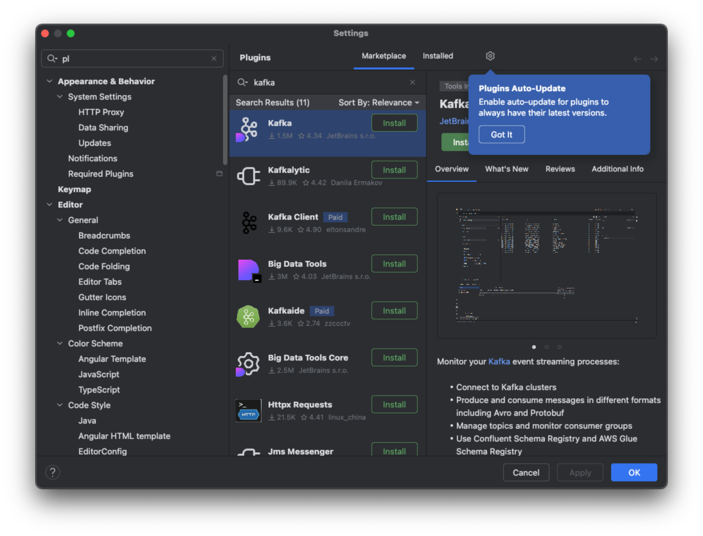
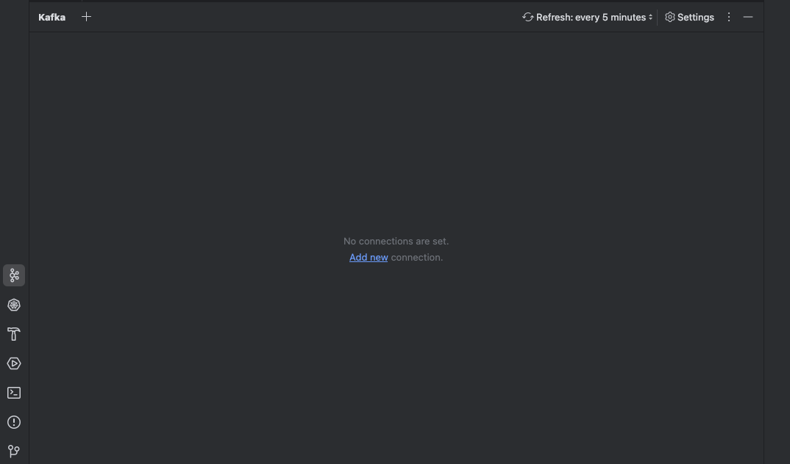

# IntelliJ로 이벤트 메시징 시스템 구성하기

## kafka 플러그인 설치
1. IntelliJ IDEA > Preferences > Plugins > Marketplace

## kafka 플러그인 실행
1. IntelliJ IDEA > View > Tool Windows > Kafka 또는 Help > kafka 검색
2. Add new 클릭 