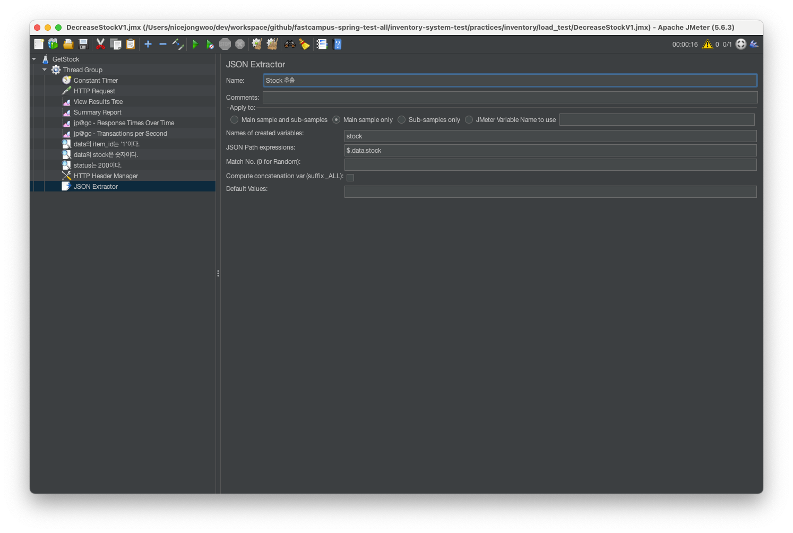
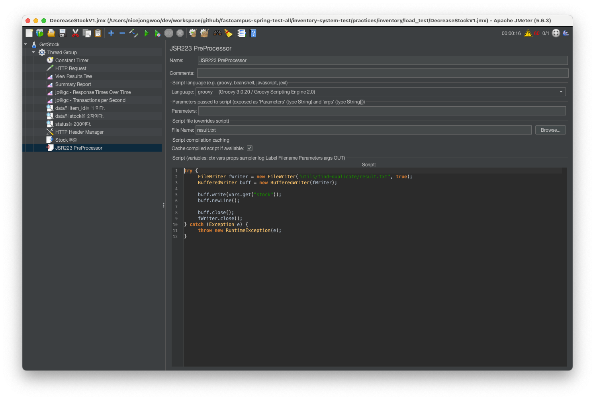
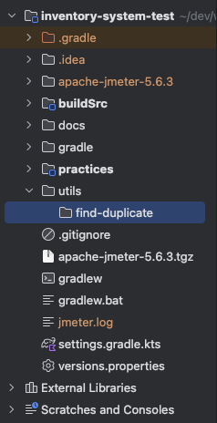

# JMeter 가이드

## JMeter 다운로드
https://jmeter.apache.org/download_jmeter.cgi

1. JMeter 다운로드 후 압축해제
2. apache-jmeter-x.x.x 의 `bin/jmeter` 실행

## JMeter plugin manager 다운로드
https://jmeter-plugins.org/wiki/PluginsManager

1. JAR file 다운로드(jmeter-plugins-manager-1.10.jar)
2. apache-jmeter-x.x.x 의 `lib/ext` 폴더에 JAR 파일 복사

## 3 Basic Graphs 다운로드

1. 상단 `Options` 메뉴에서 plugin manager 실행
2. `Available Plugins`에서 `3 Basic Graphs` 검색
3. 체크 후 하단 `Apply Changes and Restart JMeter` 실행

## JMeter 실행 및 플러그인 설치
- `tar -zxvf apache-jmeter-x.x.x.tgz`
- `cd apache-jmeter-x.x.x/bin`
- `./jmeter`
- Options > Plugins Manager > Available Plugins > 3 Basic Graphs > Apply Changes and Restart JMeter

## JMeter GetStock 부하 테스트
- Test Plan > Name: GetStock > Save > practice/inventory/load_test/GetStock.jmx
- GetStock > Add > Threads(Users) > Thread Group
  - GetStock > Add > Timer > Constant Timer
  - GetStock > Add > Sampler > HTTP Request
  - GetStock > Add > Listener > View Results Tree
  - GetStock > Add > Listener > Summary Report
  - GetStock > Add > Listener > jp@gc - Response Time Over Time
  - GetStock > Add > Listener > jp@gc - Transaction per Second
  - GetStock > Add > Assertions > JSON Assertion
  - GetStock > Add > Assertions > Response Assertion

## JMeter DecreaseStock 부하 테스트
- 테스트의 결과를 확인하기 위해 파일로 저장을 하려고 함
- JMeter를 현재 프로젝트를 기준으로 실행해야 함 (inventory-system-test 폴더에서 `./apache-jmeter-x.x.x/bin/jmeter` 실행)
- GetStock.jmx를 DecreaseStockV1.jmx로 복사
- 실행된 JMeter에서 DecreaseStockV1.jmx 파일을 열기
- GetStock > Add > Threads(Users) > Thread Group
  - GetStock > Add > Config Element > HTTP Header Manager
  - GetStock > Add > Post Processors > JSON Extractor   
  - GetStock > Add > Post Processors > JSR223 PostProcessor      