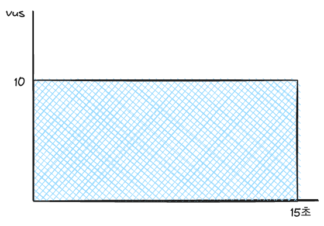
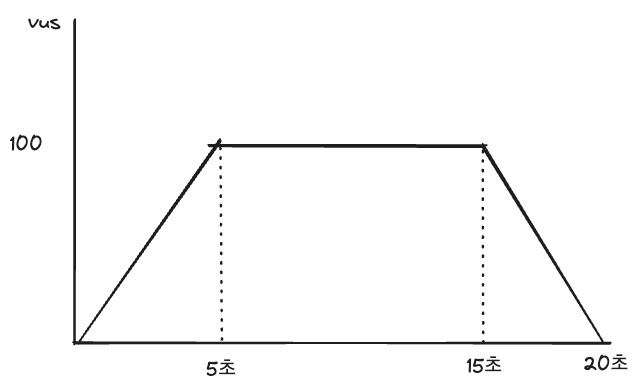

# k6 가이드

## 1. k6 설치하기

https://k6.io/docs/get-started/installation
또는 brew를 사용하여 설치할 수 있습니다.

```shell
brew install k6
```

> [!NOTE]
>
> 아래부터는 `practices/inventory/load_test/k6` 기준으로 스크립트를 실행합니다.
>

## 2. k6 새로운 스크립트 만들기

```shell
k6 new sample.js
```

## 3. k6 스크립트 실행하기

```shell
k6 run sample.js
```

## 4. k6 결과 확인하기

```
         /\      Grafana   /‾‾/  
    /\  /  \     |\  __   /  /   
   /  \/    \    | |/ /  /   ‾‾\ 
  /          \   |   (  |  (‾)  |
 / __________ \  |_|\_\  \_____/ 

     execution: local
        script: sample.js
        output: -

     scenarios: (100.00%) 1 scenario, 10 max VUs, 1m0s max duration (incl. graceful stop):
              * default: 10 looping VUs for 30s (gracefulStop: 30s)


  █ TOTAL RESULTS 

    checks_total.......................: 253     8.129585/s
    checks_succeeded...................: 100.00% 253 out of 253
    checks_failed......................: 0.00%   0 out of 253

    ✓ status is 200

    HTTP
    http_req_duration.......................................................: avg=188.59ms min=175.47ms med=192.04ms max=245.54ms p(90)=197.27ms p(95)=198.58ms
      { expected_response:true }............................................: avg=188.59ms min=175.47ms med=192.04ms max=245.54ms p(90)=197.27ms p(95)=198.58ms
    http_req_failed.........................................................: 0.00%  0 out of 253
    http_reqs...............................................................: 253    8.129585/s

    EXECUTION
    iteration_duration......................................................: avg=1.2s     min=1.17s    med=1.19s    max=1.63s    p(90)=1.19s    p(95)=1.2s    
    iterations..............................................................: 253    8.129585/s
    vus.....................................................................: 3      min=3        max=10
    vus_max.................................................................: 10     min=10       max=10

    NETWORK
    data_received...........................................................: 763 kB 25 kB/s
    data_sent...............................................................: 18 kB  591 B/s


running (0m31.1s), 00/10 VUs, 253 complete and 0 interrupted iterations
default ✓ [======================================] 10 VUs  30s
```

**http_reqs**: 전체 요청 수 (위에서는 125번)
**http_req_failed**: 전체 실패 수와 퍼센티지 (위에서는 0.00%, 0번)
**http_req_duration**: 요청을 받는데 걸린 시간. `http_req_sending` + `http_req_waiting` + `http_req_receiving`
**iterations**: 전체 반복 수 (위에서는 125번)
**vus**: 요청을 보낸 가상 사용자 수 (위에서는 5명)

## 5. 요청 수 설정하기

### 고정된 virtual user로 요청 보내기

```js
export const options = {
    // A number specifying the number of VUs to run concurrently.
    vus: 10,
    // A string specifying the total duration of the test run.
    duration: '15s',
}
```



vus * 15(duration) * rps(초당 요청 수) = 전체 요청 수

```js
sleep(1); // 1 rps와 비슷
sleep(0.25) // 4 rps와 비슷
```

### ramping-vus로 점진적으로 요청 늘리기

```js
export const options = {
    scenarios: {
        getStock: {
            executor: 'ramping-vus',
            startVUs: 0,
            stages: [
                {duration: '5s', target: maxVus},
                {duration: '10s', target: maxVus},
                {duration: '5s', target: 0},
            ],
        }
    }
}
```



(maxVus * 5 / 2 + maxVus * 10 + maxVus * 5 / 2) * rps = 전체 요청 수
15 * maxVus * rps = 전체 요청 수

참고: https://k6.io/docs/using-k6/metrics/reference