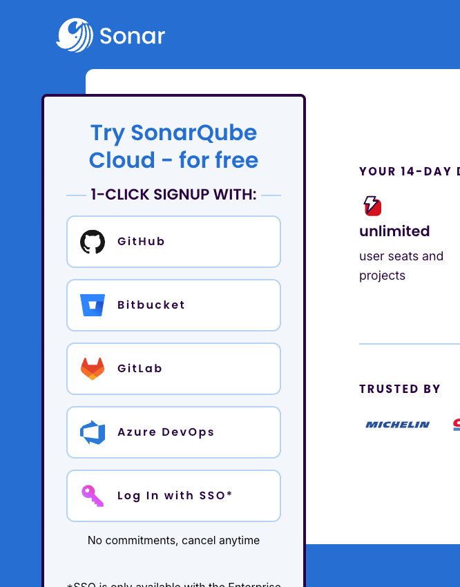
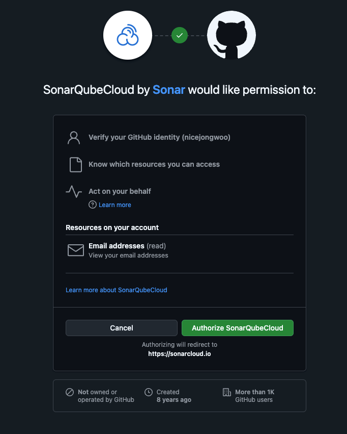
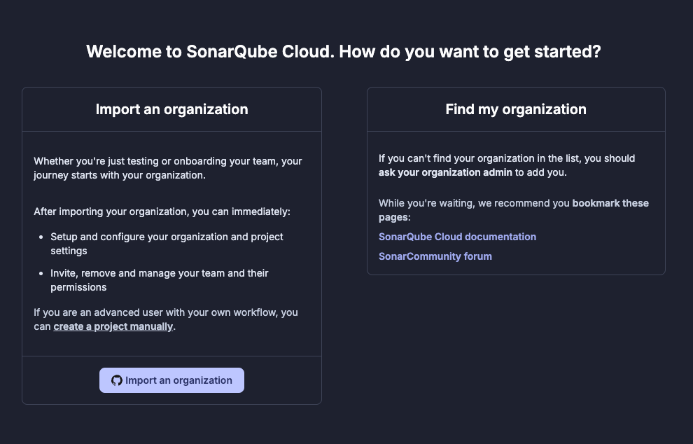
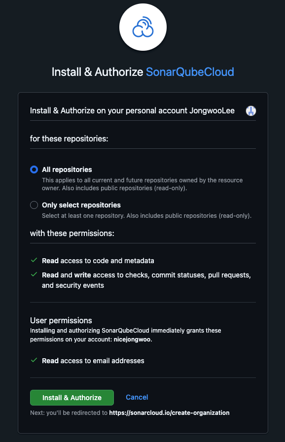
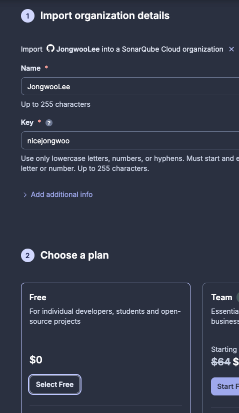
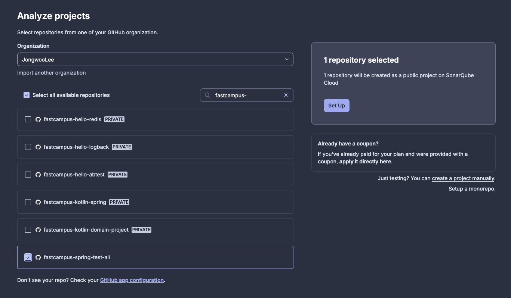
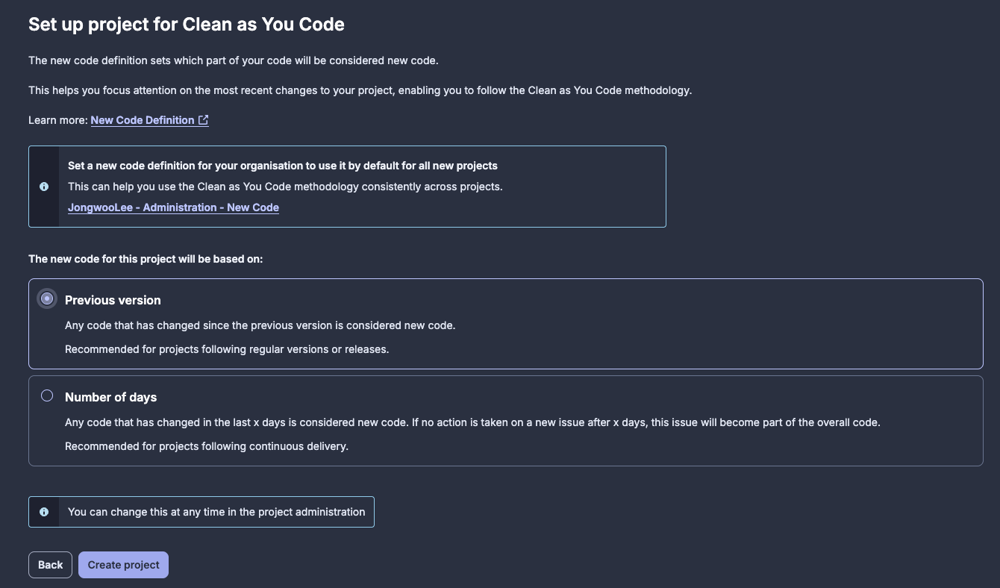
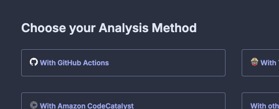
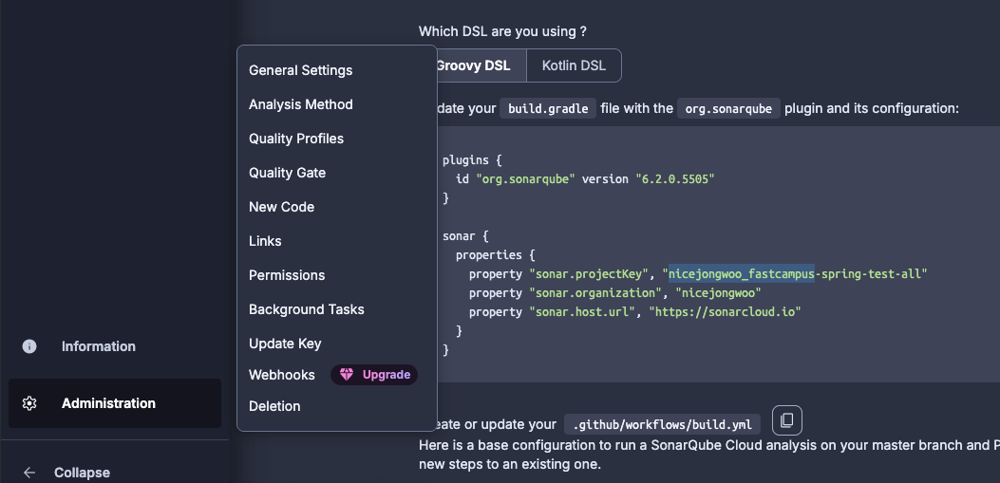
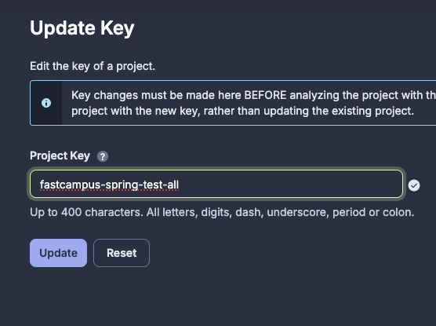

# SonarQube Cloud Guide

## 홈페이지
https://www.sonarsource.com/

## 회원가입
https://www.sonarsource.com/products/sonarcloud/signup/

## Project link
https://sonarcloud.io/projects

squ_c43b5741992c46b3fd566926111b0f83000eb793