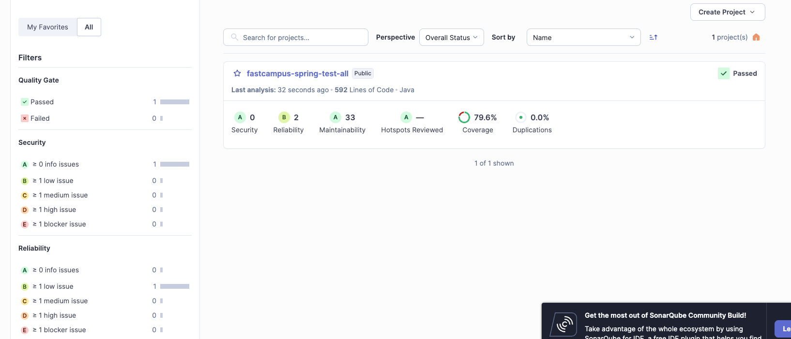

# SonarQube Local Container Guide

## 로컬 SonarQube Docker
```shell
docker run -d --name sonarqube \
  -p 9000:9000 \
  sonarqube:community
```

## 로컬 SonarQube에서 사용자 토큰 발급
- 브라우저로 http://localhost:9000 접속
- 로그인: admin / admin (기본계정 -> 이후 update)
- 우측 상단 "My Account" → "Security"
- "Generate Tokens"에서 토큰 생성 → 복사

## act 실행
```shell
act -j local-inventory-sonarqube -W .github/workflows/pr_local.yml
```

## Project link
http://localhost:9000/projects
